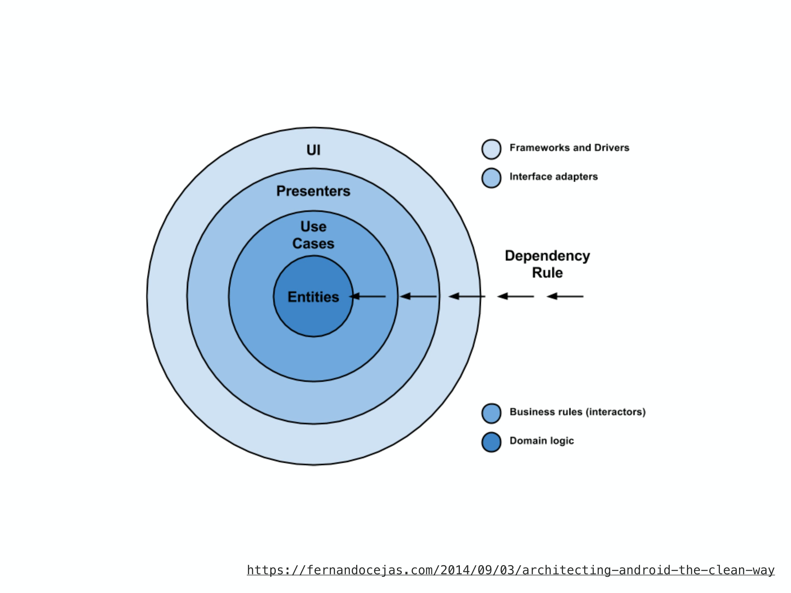

# The Clean Architecture

로버트 C. 마틴(Robert Martin, a.k.a)이 공개한 Clean Architecture를 공부하며 작성하는 문서입니다.

> <그림. The Clean Architecture의 다이어 그램>

현재 프로그래밍 세상에는 여러 아키텍쳐가 존재한다. 이들은 모두 다음과 같은 시스템을 생성한다.

1. 프레임워크 독립적.
   이들 아키텍처는 소프트웨어 라이브러리 존재 여부에 의존하지 않는다. 이는 시스템을 프레임워크의 한정된 제약에 억지로 집어넣는 대신 도구로써 사용하는 것을 가능하게 한다. ( React에서만 적용되지 않는다. )
2. 테스트에 용이함.
   비즈니스 규칙은 UI, 데이터베이스, 웹 서버, 기타 외부 요인없이 테스트가 가능하다.
3. UI 독립적.
   시스템의 나머지 부분을 변경할 필요 없이 UI를 쉽게 변경할 수 있다. 예를 들어 웹 UI는 비즈니스 규칙 변경 없이 콘솔 UI와 치환된다.
4. 데이터 베이스 독립적.
   오라클 또는 SQL Server를 몽고, 빅테이블 카우치 DM 등으로 바꿀 수 있다. 비즈니스 규칙은 데이터베이스에 얽매이지 않는다.
5. 외부 기능 독립적.
   실제로 비즈니스 규칙은 외부 세계에 대해 아무것도 모른다.

## 의존 규칙

이들 동심원은 소프트웨어의 각기 다른 영역을 나타내고 있다. (마치 OIS7계층 같은 느낌) 대개, 바깥쪽으로 향 할수록 고수준의 소프트웨어가 된다. 바깥쪽의 원은 메커니즘이고 안쪽의 원은 정책이다.

CleanArchitecture가 기능하기위해 중요한 규칙이 바로 의존규칙이다. 이 규칙에 의해서 소스코드는 안쪽을 향해서만 의존할 수 있다. 안쪽의 원은 바깥쪽의 원에 대해 전혀 알지 못한다. 특히, 바깥쪽의 원에서 선언된 어떠한 이름을 안쪽 원에서 참조해서는 안된다. 이는 함수, 클랫, 변수 등 이름이 붙은 소프트웨어의 엔티티 모든 것에 해당한다.

## 엔티티 (Entities)

엔티티계층은 대규모 프로젝트 레벨의 비즈니스 규칙을 캡슐화 한다. 엔티티는 메서드를 갖는 객체 일 수도 있지만 데이터 구조와 함수의 집합일 수도 있다. 대규모 프로젝트 내의 다양한 애플리케이션에서 사용된다고 하더라도 문제가 될 일은 없다.

대규모 프로젝트가 아닌 단지 하나의 애플리케이션을 작성할 뿐이라면 엔티티는 그 애플리케이션의 비즈니스 객체가 된다. 엔티티는 가장 일반적이면서 고수준의 규칙을 캡슐화한다. 그리고 바깥쪽에서 무엇이 변경되더라도 바뀌지 않는다. 예를들어 엔티티 객체는 페이지 내비게이션의 변경이나 보안 사항으로 부터 영향을 받지 않을 것을 기대할 수 있다. 애플리케이션의 동작에 관한 변경이 엔티티 계층에 영향을 주어선 안된다.

## 유스케이스 (Use Cases)

유스케이스 계층의 소프트웨어는 애플리케이션 고유 비즈니스 규칙을 포함하며 시스템의 모든 유스케이스를 캡슐화하고 구현한다. 이들 유스케이스는 엔티티로 부터의 혹은 엔티티에서의 데이터 흐름을 조합한다. 그리고 엔티티 즉, 프로젝트 레벨의 비즈니스 규칙을 사용해 유스케이스의 목적을 달성하도록 지휘한다.

이 계층의 변경이 엔티티에 영향을 주지 않을 것을 기대하며 데이터베이스, UI 또는 공통의 프레임워크의 변경으로부터 영향 받지 않을 것도 기대한다. 이 계층은 그러한 관심에서 격려된다.

하지만 애플리케이션의 조작에 대한 변경은 유스케이스에 영향이 있고 따라서 이 계층의 소프트웨어에 영향이 있을 것을 기대한다. 유스케이스의 상세가 바뀐다면 이 계층의 코드는 확실히 영향을 받는다.

## 인터페이스 어댑터 (Interface Adapter)

인터페이스 어뎁터 계층의 소프트웨어는 어댑터의 집합이다. 이는 유스케이스와 엔티티에 있어 용이한 형식으로부터 데이터베이스나 웹 등 외부의 기능에 용이한 형식으로 데이터를 변환한다. 이 레이어는 GUI의 MVC 아키텍처를 완전히 내포한다. 프리젠터, 뷰, 컨트롤러는 모두 여기에 속한다. 모델은 컨트롤러에서 유스케이스로 전달되고 이어 유스케이스에서 프리젠터나 뷰로 되돌아가는 그저 단순한 데이터 구조일 가능성이 높다.

마찬가지로 이 계층에서 데이터는, 엔티티나 유스케이스에 용이한 형에서, 사용하고 있는 프레임워크에 용이한 형으로 변형된다. 예를 들어 데이터베이스에 관해 아는 것이 없어야 한다. 만약 데이터베이스가 SQL 데이터베이스라면 어떤 SQL이든 이 계층에 제한돼야 하며 특히, 이 계층 내의 데이터 베이스와 관련 있는 부분에 제한돼야 된다.

또 이 계층에는 외부의 어떠한(외부 서비스) 형식에서 유스케이스와 엔티티에서 사용될 수 있는 내부 형식으로 데이터를 변환하기 위해 필요한 기타 모든 어댑터도 들 수 있다.

## 프레임워크와 드라이버

가장 바깥쪽의 계층은 데이터베이스나 웹 프레임워크 등 일반적으로 프레임워크나 도구로 구성된다. 대개, 이 계층에는 안쪽의 원과 통신할 연결 코드 이외에는 별다른 코드를 작성하지 않는다.

이 계층에는 상세한 정보가 무엇이든 여기에 둔다. 웹은 상세하다. 그리고 데이터베이스도 상세하다. 이러한 것으로 인해 악영향을 주지 않도록 밖에 유지한다.

## 4개의 원?

원이 4개로 이루어진 이유는 딱히 없다. 단지 컨셉일 뿐 이다. 따라서 이 4가지 이외에도 무엇인가 필요할 가능성이 있다. 정확히 4가지가 아니면 안된다는 규칙은 없다. 하지만 의존 규칙은 항상 적용된다. 소스코드의 의존성은 항상 안쪽으로 향해야 한다. 안쪽으로 향해감에 따라 추상화 수준은 올라간다. 가장 바깥쪽의 원은 저수준의 구체적인 상세 정보를 담는다. 안쪽으로 이동해가면서 소프트웨어는 추상화 되고 고수준의 정책을 캡슐화한다. 가장 안쪽에 있는 원은 무엇보다 일반성이 있다.

## 교차 경계

다이어그램의 오른쪽 아래를 보면 어떤식으로 원의 경계가 교차하는지 보여준다. 이것은 컨트롤러와 프리젠터가 다음 계층인 유스케이스아 어떻게 대화하는지 보여준다. 제어의 흐름에 주의하길 바란다. 컨트롤러에서 시작해 유스케이스를 거쳐 프리젠터에서 실행됨을 알 수 있다. 소스 코드의 의존성에도 주의한다. 모두 안쪽의 유스케이스를 향하고 있다.

우리는 이 분명한 모순을 의존관계역전의법칙 으로 해결하는 경우가 많다. 예를들어 Java와 같은 언어에서는 인터페이스와 상속 관계를 조합해 소스 코드의 의존성이 경계를 걸치고 있는 오른쪽 지점에서 제어 흐름이 반대하도록 한다.

다시 예를들어 유스케이스가 프리젠터를 호출할 필요가 있는 경우를 생각해보자. 이때의 호출은 직접 이루어 질 수 없다. 왜냐하면 `의존성 규칙`을 위반하기 때문이다. 때문에 유스케이스에는 안쪽 원에 있는 인터페이스(Use Case Output Port)를 호출한다. 그리고 원 바깥쪽의 프리젠터는 이 인터페이스를 구현한다.

이와 똑같은 테크닉이 아키텍처의 경계가 교차되는 곳에서 사용된다. 동적인 다향성의 이점을 이용해 소스 코드의 의존성이 제어 흐름의 반대가 되도록 한다. 이렇게 하면 제어의 흐름이 어떤 방향으로 진행되든지 상관없이 의존성 규칙을 지킬 수 있다.

## 어떤 데이터가 경계를 교차할까?

대부분 경계를 넘나드는 데이터는 단순한 구조의 데이터이다. 기본적인 구조체나 단순한 데이터 전송 객체를 취향에 맞게 사용할 수도 있다. 혹은 데이터는 단순히 함수의 인수라고 해도 좋다. 또는, 그것을 해시맵으로 해도 좋고 객체로 구성해도 좋다. 중요한 것은 격리된 단순한 구조의 데이터가 경계를 넘어간다는 점이다.

예를 들어 여러 데이터베이스는 쿼리에 응답하여 편리한 데이터 포맷을 반환한다. 이것을 `행 구조`라고 하는데 이때, 이 행 구조가 각 아키텍쳐. 즉 각각의 계층으로 이루어진 경계면을 넘어 안쪽으로 전달 된다면 의존성 규칙을 위반한다. 때문에 경계를 넘어 데이터를 전달할 때는 항상 안쪽의 원이 다루기 쉬운 데이터 형식이어야 한다.

## 결론

소프트웨어 계층으로 나누고 의존성 규칙을 따름으로서 본질적으로 테스트하기 쉬운 시스템을 만들 수 있어진다. 또 의존성 규칙이 가져오는 이점도 얻을 수 있다. 시스템의 외부 부품(DB나 프레임워크)이 낡았을때 그러한 부분을 최소한의 노력으로 바꿀 수 있다.

---

**참고**

> https://blog.coderifleman.com/2017/12/18/the-clean-architecture/ > https://academy.realm.io/kr/posts/clean-architecture-in-android/
