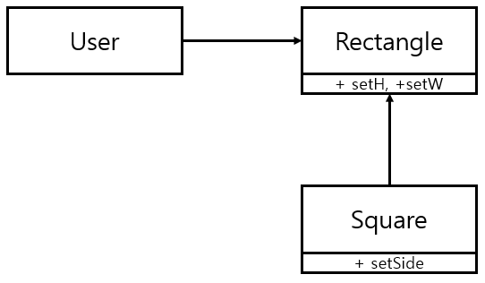

# Chap.9 LSP: 리스코프 치환 원칙

1988년 **바바라 리스코프는** 하위 타입을 아래와 같이 정의했다.

치환 원칙

* S 타입의 객체 o1에 대응하는 T 타입 객체 o2가 있다. → o1: S, o2:T
* 이때 T타입을 이용하여 정의한 모든 프로그램 P에서
* o2의 자리에 o1을  치환해도 P의 행위가 변하지 않는다면
* S는 T의 하위 타입이다.

## 상속을 사용하도록 가이드하기

위 설계는 LSP를 준수한다.

* `Billing` 애플리케이션의 행위가 `License`하위 타입 중 무엇을 사용하는지에 전혀 의존하지 않기 떄문.

## 정사각형/직사각형 문제

해당 예제는 LSP를 위반한다.

* Square는 Rectangle의 하위 타입으로는 적합하지 않은데, Rectangle의 높이와 너비는 서로 독립적으로 변경될 수 있는 반면
* Square의 높이와 너비는 반드시 함께 변경되기 때문.
* User에게 혼동이 갈 수 있다.
* 이를 해결하기위해 Square인지를 검사하는 조건문을 사용할 수 있다. → User가 Square를 알게됨
* → 타입을 서로 치환할 수 없음

## LSP와 아키텍처

* LSP는 인터페이스와 구현체에도 적용된다.
* 아키텍처 관점에서 LSP를 이해하는 최선의 방법은 이 원칙을 어겼을 때 시스템 아키텍처에서 무슨 일이 일어나는지 관찰하는 것 이다.

## LSP 위배 사례

### 결론

* 아키텍트는 REST 서비스들의 인터페이스가 서로 치환 가능하지 않다는 사실을 처리하는 중요하고 복잡한 매커니즘을 추가해야 한다.

## 결과

* LSP는 아키텍처 수준까지 확장할 수 있고, 반드시 확장해야만 한다.
* 치환 가능성을 조금이라도 위배하면 시스템 아키텍처가 오염되어 상당량의 별도 메커니즘을 추가해야 할 수 있기 때문이다.

