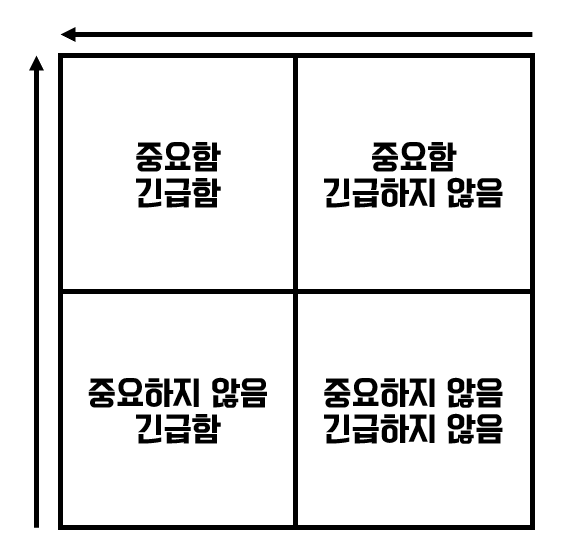

# Chap.2 두 가지 가치에 대한 이야기

모든 소프트웨어 시스템은 이해관계자에게 두가지 가치를 제공한다. 바로 **행위\(behavior\)**와 **구조\(structure\)**이다. 이 둘 중 덜 중요한 가치에 집중하는 개발자가 대부분이다. 이는 소프트웨어 시스템을 쓸모없게 만들게 된다.

## 행위

소프트웨어의 첫 번째 가치는 바로 **행위**이다. 프로그래머는 이해관계자의 기능 명세나, 요구사항 문서를 구체화 할 수 있도록 한다. 그리고 소프트웨어가 에러를 발생시키면 프로그래머는 디버거를 열고 문제를 고친다.

많은 프로그래머가 이러한 활동들이 프로그래머로써의 할 일의 전부라고 생각한다. 하지만 이는 틀린 사실이다.

## 아키택처

소프트웨어의 두 번째 가치는 **소프트웨어**라는 단어와 관련이 있다. 소프트웨어라는 단어는 부드러운\(soft\) 제품\(ware\)라는 단어의 합성어 이다. 따라서 소프트웨어는 부드러워야 한다.

소프트웨어가 갖는 본연의 목적을 추구하기 위해선 반드시 '부드러워'야 한다. **즉, 변경하기 쉬워야 한다.** 이해관계자의 변경사항을 간단하고 쉽게 적용할 수 있어야 한다.

소프트웨어 개발 비용의 증가를 결정짓는 주된 요인은 바로 이 변경사항의 범위와 차이에 있다. 그리고 이 문제는 시스템의 아키택처 때문에 발생한다. 그리고 해결법도 아키택처에 있다. 따라서 **아키택처의 형태는 독립적이게 만들어야 한다.**

## 더 높은 가치

* 기능 vs 아키택처
* 둘 중 어느 것의 가치가 더 높은가?
* 소프트웨어 시스템이 동작하도록 만드는 것이 더 중요한가?
* 소프트웨어 시스템을 더 쉽게 변경할 수 있도록 하는 것이 더 중요한가?

이러한 질문에 개발자와 이해관계자의 의견을 들어보면 아마 이렇게 답할 것 이다.

_**"소프트웨어 시스템이 동작하는 것이 더 중요하다."**_

하지만 작가는 잘못된 태도라고 말한다.

다음은 작가가 해당 의견을 반박하는 내용이다.

완벽하게 동작하지만 수정이 아예 불가능한 프로그램은 프로그램이 돌아가도록 만들 수 없게 된다. 따라서 이러한 프로그램은 거의 쓸모가 없다.

동작은 하지 않지만 변경이 쉬운 프로그램은 프로그램이 돌아가도록 만들 수 있다. 즉, 유지보수를 할 수 있다. 따라서 이러한 프로그램은 앞으로도 유용한채로 남는다.

이러한 주장이 설득력이 떨어지는 것은 사실이다. 변경이 완전히 불가능한 프로그램은 존재하지 않기 때문이다. 하지만 현실적으로 불가능한 프로그램은 존재한다.

## 아이젠하워 매트릭스

드와이트 D. 아이젠하워 미국 대통령이 고안한 중요성과 긴급성에 관한 아이젠하워 매트릭스를 살펴보면..

이와 같은 표를 볼 수 있다. 소프트웨어의 첫 번째 가치인 **행위**는 긴급 + 중요를 가지는 것은 아니다. 하지만 두 번째 가치인 **아키택처**는 중요 + 긴급성을 필요료 한다.

아이젠하워 매트릭스를 소프트웨어 적으로 나열해보면

1. 긴급하고 중요한
2. 긴급하지는 않지만 중요한
3. 긴급하지만 중요하지 않은
4. 긴급하지도 중요하지도 않은

이렇게 표현할 수 있다.

여기서 아키택처가 가장 높은 두 순위를 차지하고, 행위가 첫 번째와 세 번째에 위치하는 점을 주목하자.

## 아키텍처를 위해 투쟁하라

아키택처가 후 순위가 되면 시스템을 개발하는 비용이 더 많이 들고, 일부 또는 전체 시스템에 변경을 가하는 일이 현실적으로 불가능해진다. 이러한 상황이 발생하도록 용납했다면, 이는 결국 소프트웨어 개발팀이 스스로 옳다고 믿는 가치를 위해 투쟁하지 않았다는 뜻이다.

