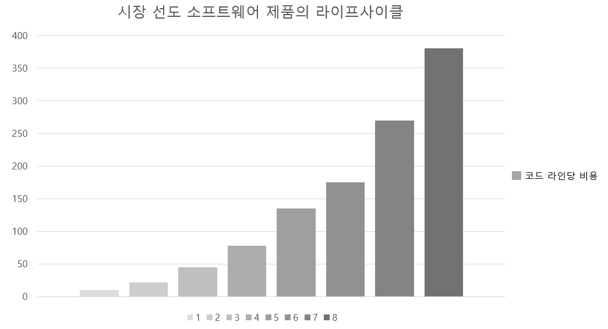

# Chap.1 설계와 아키텍처란?

 책의 목적 중 하나는 **설계**와 **아키텍처** 사이에 존재하는 혼란을 없애고, 설계와 아키텍처가 무엇인지 완전하게 정의하는 것 이다. 이에 대한 답을 미리 내려보면 **둘 사이에는 아무런 차이가 없다.**

 새로운 집을 설계하는 아키텍트가 있다고 할 때, 이 집은 아키텍처를 가지고 있다. 이때 이 집의 아키텍처는 무엇일까? 대답은 집의 형태, 외관, 입면도, 공간이나 방의 배치 등이 여기에 포함된다. 하지만 아키텍트가 만든 도면을 살펴보면 무수히 많은 저 수준의 세부 사항도 확인할 수 있다. 콘센트, 전등 스위치, 전등이 모두 어디에 위치하는 지를 도면에서 알 수 있다. 보일러는 어디에 놓이고, 온수기와 배출 펌프의 크기와 위치는 어떻게 되는지, 벽, 지붕 그리고 기초 공사가 어떻게 진행되는지도 상세히 확인할 수 있다. 즉, **모든 고 수준의 결정 사항을 지탱하는 모든 세부 사항을 자세하게 확인할 수 있다.** 이와 같이 저 수준의 세부 사항과 고 수준의 결정 사항은 집의 전체 설계의 구성 요소가 된다.

 소프트웨어 설계도 마찬가지이다. **저 수준의 세부 사항과 고 수준의 구조는 모두 소프트웨어 전체 설계의 구성 요소이며 이 둘은 단절 없이 이어진 직물과 같으며, 이를 통해 대상 시스템의 구조를 정의한다.** 개별로는 존재할 수 없고, 실제로 이 둘을 구분 짓는 경계는 뚜렷하지 않다. 고 수준에서 저 수준으로 향하는 의사 결정의 연속성 만이 있을 뿐이다.

### 목표는?

 좋은 소프트웨어 설계의 목표는 무엇일까. 로버트 C 마틴은 이렇게 답한다.

> 소프트웨어 아키택처의 목표는 필요한 시스템을 만들고 유지 보수하는 데 투입되는 인력을 최소화하는 데 있다.
>
> -- 로버트 C 마틴

 **설계 품질을 재는 척도는 고객의 요구를 만족 시키는 데 드는 비용을 재는 척도와 다름없다.** 이 비용이 시스템의 수명이 다할 때까지 낮게 유지할 수 있으면 좋은 설계라고 말할 수 있다. 즉, 새로운 기능을 출시할 때마다 비용이 증가하면 나쁜 설계이다.

### 사례 연구

한 사례가 있다. 이 사례는 익명으로 남길 원하는 실제 회사의 진짜 데이터 이다. 먼저 엔지니어링 직원 수가 늘어나는 추세를 살펴보면 이와 같은 상황을 분명 굉장히 고무적인 상황으로 여길 수 있다. 그림 1.1을 보면 알 수 있다.

이제 같은 기간 회사의 생산성을 확인한다. 생산성은 단순히 코드 라인 수로 측정한다.

매번 새로운 기능을 출시할 때마다 개발자의 수는 지속적으로 증가하지만 코드 생산성은 마치 한 곳으로 수렴하는 것처럼 보인다. 다음 그림 1.3은 같은 기간에 코드 한 라인당 비용이 어떻게 변했는지를 보여준다.

이러한 추세를 보이는 회사는 오래 갈 수 없다. 지금 당장의 수익은 있을지 몰라도 회사의 성장을 멈추게 하거나 완전히 망하게 만드는 일이다. 이처럼 생산성을 현저하게 변화시킨 요인은 대체 무엇인가? 여덟 번째 출시한 제품의 코드는 처음 제품보다 왜 40배나 더 많은 비용이 드는가?에 대한 생각을 해볼 필요가 있다.

### 엉망진창이 되어 가는 신호

시스템을 급하게 만들거나, 결과물의 총량을 순전히 프로그래머 수만으로 결정하거나, 코드와 설계의 구조를 깔끔하게 만들려는 생각을 전혀 하지 않으면, 파국으로 치닫는 이 비용 곡선에 올라타게 된다. 그림 1.4는 이 비용 곡선을 개발자 관점에서 보여준다.

출시할 때마다 하락하는 그래프를 확인할 수 있다. 개발자 입장에서 보자면 이러한 현상은 엄청난 절망감을 안겨준다. 모두가 열심히 일하고 있고 전력을 기울이지 않는 개발자는 없다. 개발자가 이렇게 초인적인 노력을 하지만 결과는 다음과 같다. 생산성은 점점 떨어지고 노력에 대응하는 결과는 나오지 않는다. 엉망이 된 상황에 대처하는 데 나머지 인력을 소모하게 된다. 결국 개발자들이 쏟은 노력의 가치가 보잘 것 없게 된다.

### 경영자의 시각

이러한 상황을 경영자 입장에서 살펴보면 다음과 같다. 그림 1.5는 같은 기간에 개발하는 데 쓰인 월별 인건비를 보여준다.

첫 번째 출시에는 매월 수 십만 달러의 인건비 만으로 제품을 전달하나, 두 번째 출시에서는 수 십만 달러가 더 들었다. 점점 금액이 증가하는 추세인데, 그림 1.5와 1.2의 출시 별 코드 라인 수를 비교해보면 초기 출시에는 적은 비용으로 많은 기능을 탑재할 수 있지만 마지막 출시에는 2천만 달러를 들이고도 얻은 것이 거의 없다.

### 무엇이 잘못되었나?

현 개발자들은 **"코드는 나중에 정리하면 돼. 당장은 시장에 출시하는 게 먼저야!"** 라는 생각으로 개발에 임한다고 한다. 이들은 모두 나중에 가도 코드를 정리하지 않게 된다. 왜냐하면 시장은 계속해서 압박을 주기 때문이다. 출시를 하고 나면 다음에 만들어야 할 기능이 또 있고, 또 다음 기능, 또또 다음 기능이 기다리고 있다. 이처럼 **생산성은 0을 향해 수렴하게 된다.**

코드를 엉망으로 만들면 깔끔하게 유지할 때보다 항상 더 느리다. 시간 척도를 어떻게 보든지 관계없이 말이다.

> 빨리 가는 유일한 방법은 제대로 가는 것 이다.

생산성이 감소되고 비용이 증가하는 현상을 되돌릴 수 있는 유일한 방법은 엉망진창인 코드를 개발자가 책임지게 하는 것 이다.

### 결론

최고의 선택지는 **조직에 스며든 과신을 인지하여 방지하고, 소프트웨어 아키텍처의 품질을 심각하게 고민하기 시작하는 것 이다.**

이를 위해서는 좋은 소프트웨어 아키택처가 무엇인지 이해해야 한다. 비용은 최소화하고 생산성은 최대화 할 수 있는 설계와 아키텍처를 가진 시스템을 만들려면, 이러한 결과로 이끌어 줄 시스템 아키텍처가 지닌 속성을 알고 있어야 한다.

